<!-- Generated by GitHub Profile Agent Console. Edit profile.config.json, then run npm run generate. -->

  <picture>
    <source media="(max-width: 760px) and (prefers-color-scheme: dark)" srcset="./assets/hero/agent-console-3febde22-mobile-dark.svg">
    <source media="(max-width: 760px)" srcset="./assets/hero/agent-console-3febde22-mobile-light.svg">
    <source media="(prefers-color-scheme: dark)" srcset="./assets/hero/agent-console-3febde22-dark.svg">
    <source media="(prefers-color-scheme: light)" srcset="./assets/hero/agent-console-3febde22-light.svg">
    
  </picture>

  
  

## About Me

I am a Machine Learning & AI Engineering student at Universitas Teknologi Yogyakarta, focused on building practical AI systems and deep learning models.

Currently exploring the intersection of model training, software development, and data pipelines to solve real-world analytical problems.

## Current Focus

| Area | What I am exploring |
| --- | --- |
| **Machine Learning** | Designing and training predictive models, neural networks, and optimizing inference performance. |
| **Artificial Intelligence** | Exploring large language models, agentic workflows, and semantic search systems. |
| **Software Engineering** | Building robust APIs, data pipelines, and database systems to support AI-driven applications. |

## Featured Work

| Project | Focus | Why it matters |
| --- | --- | --- |
| [**AI Image Processor**](https://github.com/WaldiBahyHanif/ai-image-processor) | Computer Vision | A pipeline utilizing deep learning to perform automated segmentation and processing of visual assets. |
| [**Agentic Chatbot**](https://github.com/WaldiBahyHanif/agentic-chatbot) | Natural Language Processing | An autonomous agent system integrated with tool execution capabilities for contextual task automation. |

## Research Direction

I am focused on designing, training, and deploying intelligent models. I explore how machine learning systems and autonomous workflows can be integrated into production software environments.

## Tech Stack

`Python` · `PyTorch` · `TensorFlow` · `Scikit-Learn` · `OpenCV` · `Pandas` · `NumPy` · `JavaScript` · `Git` · `SQL` · `Docker`

## Recent Activity

<!-- AUTO:ACTIVITY:START -->
_Recent public activity will appear here after the workflow runs._
<!-- AUTO:ACTIVITY:END -->

---

  Learning, building, and sharing intelligent systems.

