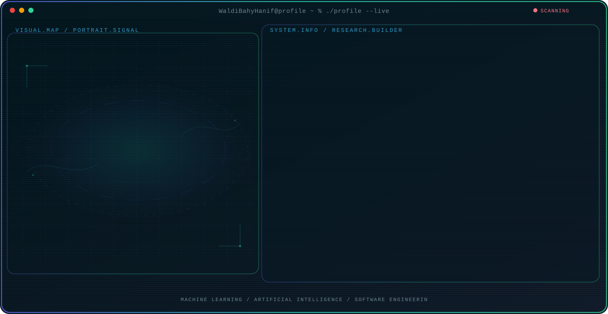
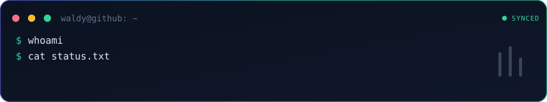

<!-- Generated by GitHub Profile Agent Console. Edit profile.config.json, then run npm run generate. -->

  <picture>
    <source media="(max-width: 760px) and (prefers-color-scheme: dark)" srcset="./assets/hero/agent-console-8b4d9f11-mobile-dark.svg">
    <source media="(max-width: 760px)" srcset="./assets/hero/agent-console-8b4d9f11-mobile-light.svg">
    <source media="(prefers-color-scheme: dark)" srcset="./assets/hero/agent-console-8b4d9f11-dark.svg">
    <source media="(prefers-color-scheme: light)" srcset="./assets/hero/agent-console-8b4d9f11-light.svg">
    
  </picture>

<h1 align="center">Waldi Bahy Hanif Ramadhani</h1>

<h3 align="center">Machine Learning & AI Engineer</h3>

  Universitas Teknologi Yogyakarta · Yogyakarta, Indonesia

  
  
  
  

  <code>Turning notebooks into shipped AI</code>

  

---

## About

ML / AI engineering student at Universitas Teknologi Yogyakarta. I learn by building smaller versions of the things I read about, then breaking them until they work.

I care about what happens after training: datasets that don't need babysitting, APIs that behave, and pipelines that run the same on my laptop and on the server.

Deep in LLM apps, agent workflows, and computer vision — mostly late at night, with way too many print statements.

**Where I'm investing time:**

- **Machine Learning** — training models, tuning them, and getting inference fast enough to feel instant.
- **Artificial Intelligence** — LLM apps, agentic workflows, and retrieval that answers before you finish typing.
- **Software Engineering** — APIs, databases, and pipelines that keep AI a product instead of a prototype.

## Featured Work

- **[AI Image Processor](https://github.com/WaldiBahyHanif/ai-image-processor)** — _Computer Vision_. Deep-learning segmentation and processing pipeline for visual assets, engineered to survive real-world batch jobs.
- **[Agentic Chatbot](https://github.com/WaldiBahyHanif/agentic-chatbot)** — _Natural Language Processing_. Chat agent with tool execution that automates real tasks instead of just talking about them.

---

## Tech Stack

  
  
  
  
  
  
  
  
  
  
  
  
  
  
  

---

## GitHub Stats

  
  

  

  

---
 

  

## Recent Activity

<!-- AUTO:ACTIVITY:START -->
- Aug 14, 2026: pushed 1 commit to [WaldiBahyHanif/learn](https://github.com/WaldiBahyHanif/learn).
- Aug 14, 2026: merged pull request [#6](https://github.com/WaldiBahyHanif/learn) in [WaldiBahyHanif/learn](https://github.com/WaldiBahyHanif/learn).
- Aug 14, 2026: opened pull request [#6](https://github.com/WaldiBahyHanif/learn) in [WaldiBahyHanif/learn](https://github.com/WaldiBahyHanif/learn).
- Aug 14, 2026: created a branch in [WaldiBahyHanif/learn](https://github.com/WaldiBahyHanif/learn).
- Aug 14, 2026: merged pull request [#5](https://github.com/WaldiBahyHanif/learn) in [WaldiBahyHanif/learn](https://github.com/WaldiBahyHanif/learn).
- Aug 14, 2026: opened pull request [#5](https://github.com/WaldiBahyHanif/learn) in [WaldiBahyHanif/learn](https://github.com/WaldiBahyHanif/learn).
<!-- AUTO:ACTIVITY:END -->

---

  Building AI systems that ship — one training run at a time.

